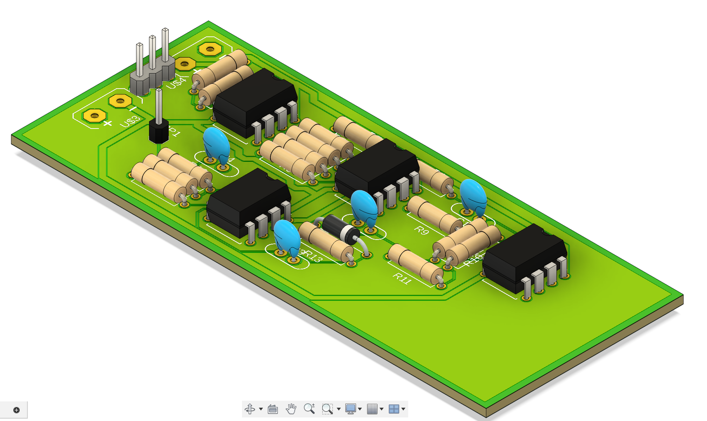
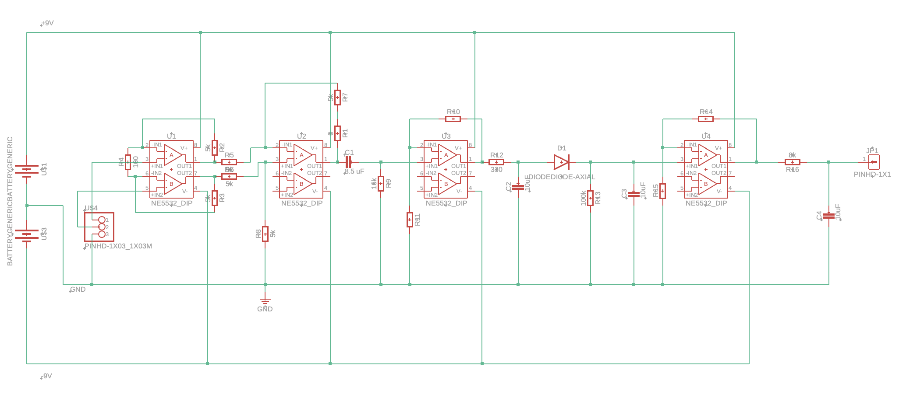
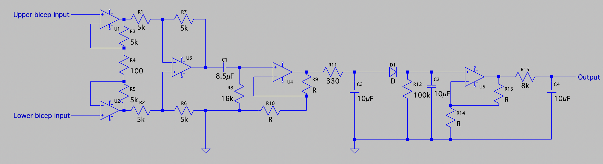

## About Me

I'm a junior Biomedical Engineering Student in the Lampe Joint Department of Biomedical Engineering at UNC and NCSU. 

- Specializing in Medical Microdevices and Rehabilitation Engineering
- Minoring in Neuroscience
- Researching neural engineering to generate artificial sensations with spinal cord stimulation

## Projects

### 1. Electromyogram-Controlled Prosthetic Hand

  
  
  
  

- This circuit is responsible for reading the voltage across my bicep muscle, allowing the attached microcontroller to close or splay the prosthetic fingers depending on the strength of muscle contraction
- C++ code for scaling EMG circuit output to control prosthetic hand movement:
  - [Download Code](./media/EMGSignalProcessing.ino)

- The circuit contains:
  -  two differential amplifier op-amp circuits with a total gain of ~1500 
  -  a bandpass filter to remove unnecessary noise from the biosignals
  -  a rectifier to convert the noisy AC signal to DC
  - a final lowpass filter to smooth the output signal sent to the microcontroller
  - Voltage output to a microcontroller between 0-2.5 V 
    

### 2. Modeling Medtronic Spinal Cord Stimulator
<table align="center">
  <tr>
    <th>3D Model</th>
    <th>Reference</th>
  </tr>
  <tr>
    <td align="center">
      
    </td>
    <td align="center">
      
    </td>
  </tr>
</table>

#### Attached File:
[Download External Spinal Cord Stimulator Model](./media/External%20Spinal%20Cord%20Stimulator.step)

### 3. Modeling Endotracheal Tube

#### Attached File:
[Download Endotracheal Tube Model](./media/Endotracheal%20Tube.step)

### 3. MATLAB Motion Tracking

https://github.com/user-attachments/assets/62bd27ae-86a2-44dc-b0a2-9f168bd17e89

https://github.com/user-attachments/assets/7a7a467b-c0f8-46e3-bbbf-b81d4bf20696

## Contact

Feel free to reach out at:

- Email: gus.e.rutledge@gmail.com | gusrutl@unc.edu
- LinkedIn: www.linkedin.com/in/gus-rutledge-2a171b23b

